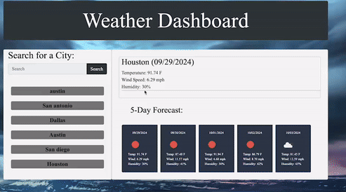

# Server-Side-APIs-Challenge

Module 6 Challenge

# Weather Dashboard

## Table of Contents

- Description
- Acceptance Criteria
- Technologies
- Installation
- Usage
- Preview / Screenshot
- Contact
- Reference
- License

## Description

This weather dashboard application allows users to search for the current and future weather outlook for multiple cities. It helps travelers plan their trips accordingly by providing essential weather information.

## Acceptance Criteria

1. **Given** a weather dashboard with form inputs.
2. **When** I search for a city.
   - **Then** I am presented with current and future conditions for that city, and that city is added to the search history.
3. **When** I view current weather conditions for that city.
   - **Then** I am presented with the city name, the date, an icon representation of weather conditions, the temperature, the humidity, and the wind speed.
4. **When** I view future weather conditions for that city.
   - **Then** I am presented with a 5-day forecast that displays the date, an icon representation of weather conditions, the temperature, the wind speed, and the humidity.
5. **When** I click on a city in the search history.
   - **Then** I am again presented with current and future conditions for that city.

## Technologies

- HTML
- CSS
- JavaScript
- Third-party APIs (e.g., OpenWeatherMap API)

## Installation

1. Download ZIP file or clone repository to your local machine using the link below:
   - https://github.com/keno213/Server-Side-APIs-Challenge
2. Using your code editor, open the `index.html` file in your preferred web browser.

## Usage

1. Enter a city name in the search input field and press Enter or click the search button.
2. View the current weather conditions and the 5-day forecast for the searched city.
3. Click on a city in the search history to view its current and future conditions again.

## Preview / Screenshot

## Contact

For more projects and information about the developer, please visit:

- https://keno213.github.io/Server-Side-APIs-Challenge/
- https://github.com/keno213/Server-Side-APIs-Challenge

## References

- UT Austin Bootcamp - UTA-VIRT-FSF-PT-02-2024-U-LOLC
- https://mdbootstrap.com/docs/standard/forms/search/examples-and-customization/
- https://getbootstrap.com/docs/4.0/components/jumbotron/
- https://openweathermap.org/forecast5#geo5
- https://getbootstrap.com/docs/5.0/forms/form-control/
- https://stackoverflow.com/questions/44177417/how-to-display-openweathermap-weather-icon
- https://stackoverflow.com/questions/49662431/display-openweathermap-api-data-on-website-using-ajax
- https://codereview.stackexchange.com/questions/120106/weather-app-using-the-openweathermap-com-api

## License

This project is licensed under MIT License.
